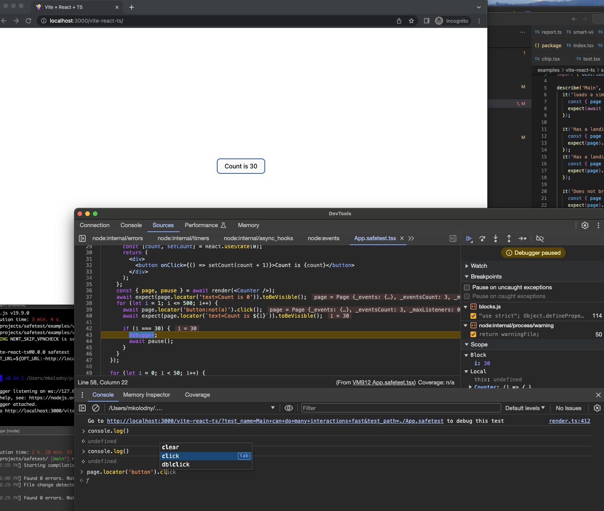
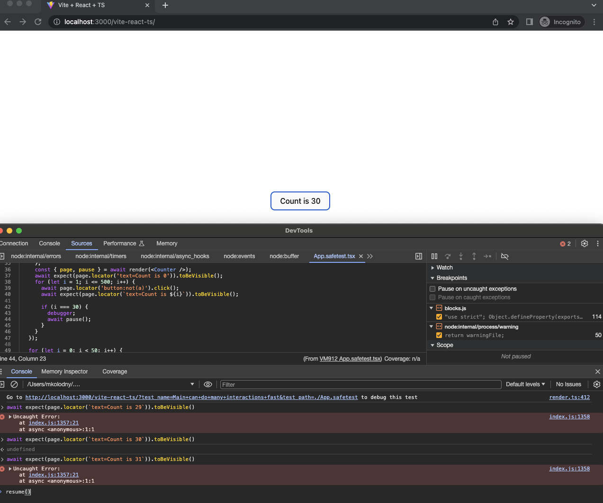

# Safetest: Next Generation UI Testing Library

Safetest is a powerful UI testing library that combines Playwright, Jest/Vitest, and React for a powerful end-to-end testing solution for applications and component testing. With Safetest, you can easily test the functionality and appearance of your application, ensuring that it works as expected and looks great on all devices.

Safetest provides a seamless testing experience by integrating with your existing development environment and offering a familiar, easy-to-use API for creating and managing tests.

## Features

- **Playwright Integration**: Run your tests on real browsers using Playwright. Safetest automatically handles browser management, so you can focus on just writing tests.
  - Screenshot diffing via [jest-image-snapshot](https://github.com/americanexpress/jest-image-snapshot)
  - [Video recording](https://playwright.dev/docs/videos)
  - [Trace Viewer](https://playwright.dev/docs/trace-viewer)
  - [Full control over network layer](https://playwright.dev/docs/network#handle-requests)
  - [Powerful overrides for complex test cases](#overrides)
- **Jest Integration**: Safetest leverages the Jest test runner. Write your tests using familiar Jest syntax and benefit from its powerful assertion library and mocking capabilities.
- **Vitest Integration**: Safetest can also use the Vitest runner. If you have a `vite` project you'll probably want to use this
- **React Support**: Safetest is designed with React applications in mind, so you can easily test your components and their interactions. This allows for focused testing of individual components, for Example testing that `<Header admin={true}>` behaves as expected.
- **Framework agnostic**: Safetest also works with other frameworks like Vue, Svelte, and Angular. See the [examples](./examples/) folder for more details. Safetest even works to [component test a NextJS](https://github.com/kolodny/safetest/blob/main/examples/next-app/src/spec.safetest.tsx) application
- **Easy Setup**: Safetest is easy to set up and configure, so you can start writing tests in no time. No need to worry about complex configurations or dependencies; Safetest takes care of it all.
- **Easy Auth Hooks**: If your app is testing an authenticated application, Safetest provides hooks to handles the auth flow in a reusable method across all your tests.

## Getting Started

To get started with Safetest, follow these steps:

1. ### Install Safetest as a dependency in your project:

   ```bash
   npm install --save-dev safetest
   ```

   Or, if you're using Yarn:

   ```bash
   yarn add --dev safetest
   ```

The following instructions assume you're using `create-react-app`. Look in the examples folder for other setup configurations.

1. ### Add run command to `package.json` scripts:

   Add the following line to your `package.json` scripts:

   ```json
   {
     "scripts": {
       "safetest": "OPT_URL=${TARGET_URL:-http://localhost:3000} react-scripts --inspect test --runInBand --testMatch '**/*.safetest.{j,t}s{,x}' --setupFilesAfterEnv ./setup-safetest.tsx",
       "safetest:ci": "rm -f artifacts.json && OPT_URL=${DEPLOYED_URL} OPT_CI=1 OPT_DOCKER=1 npm run safetest -- --watchAll=false --ci=1 --json --outputFile=results.json",
       "safetest:regenerate-screenshots": "OPT_DOCKER=1 npm run safetest -- --watchAll=false --update-snapshot"
     }
   }
   ```

   The preceding script runs the default runner (`react-scripts`) with a couple of flags and environment variables to make sure Safetest is loaded and run with jest, and that all `.safetest.tsx` test files are tested. You may need to adjust based on your specific setup for example using `craco` or `react-app-rewired` instead.

   ***

   If you're using Vitest you'd use these scripts instead:

   ```json
   {
     "scripts": {
       "safetest": "OPT_URL=${OPT_URL:-http://localhost:3000/} vitest --config vite.safetest.config",
       "safetest:ci": "rm -f artifacts.json && OPT_URL=${DEPLOYED_URL} OPT_CI=1 OPT_DOCKER=1 OPT_ARTIFACTS=artifacts.json npm run safetest -- --run --bail=5",
       "safetest:regenerate-screenshots": "OPT_DOCKER=1 npm run safetest -- --run --update"
     }
   }
   ```

   ***

   <small>A note about the `OPT_URL` and similar variables. This is used to pass flags to Safetest which will flow through different testing frameworks spawning threads or any other mechanism that would make command line flag passing practically impossible</s,all>

1. ### Add `setup-safetest.tsx` file:

   Create a file called `setup-safetest.tsx` in the root of your project and add the following code:

   ```ts
   import { setup } from 'safetest/setup';

   setup({
     bootstrappedAt: require.resolve('./src/main.tsx'),
   });
   ```

   This file is the minimal setup required to get Safetest working with your project. It's also where you can configure Safetest by specifying options to the `setup` function.

   If you're using vitest you'll need to add a vitest.safetest.config.ts file with the following config:

   ```ts
   /// <reference types="vitest" />

   import { defineConfig } from 'vite';

   // https://vitejs.dev/config/
   export default defineConfig({
     test: {
       globals: true,
       testTimeout: 30000,
       reporters: ['basic', 'json'],
       outputFile: 'results.json',
       setupFiles: ['setup-safetest'],
       include: ['**/*.safetest.?(c|m)[jt]s?(x)'],
       threads: process.env.CI ? true : false,
       inspect: process.env.CI ? false : true,
     },
   });
   ```

1. ### Bootstrapping your application

   In order for Safetest to be able to work with your application, you need to bootstrap it to load. This is done by modifying your application's entry point (usually `src/index.tsx`) as follows:

   ```diff
    import ReactDOM from "react-dom";
   +import { bootstrap } from 'safetest/react';
    import App from "./App";

   -ReactDOM.render(
   -  <App />,
   -  document.getElementById("app")
   -);
   +const container = document.getElementById("app");
   +const element = <App />;
   +
   +const isDev = process.env.NODE_ENV !== 'production';
   +
   +bootstrap({
   +  element,
   +  render: (element) => ReactDOM.render(element, container),
   +  // If using React 18:
   +  // render: (element) => ReactDOM.createRoot(container).render(element),
   +
   +  // Add one of the following depending on your bundler...
   +
   +  // Webpack:
   +  webpackContext: isDev && import.meta.webpackContext('.', {
   +    recursive: true,
   +    regExp: /\.safetest$/,
   +    mode: 'lazy'
   +  })
   +
   +  // Vite:
   +  // importGlob: isDev && import.meta.glob('./**/*.safetest.{j,t}s{,x}'),
   +
   +  // Using the `npx safetest generate-import-map src/Bootstrap.tsx src > src/imports.tsx` syntax:
   +  // imports, // Where imports is defined as `import imports from './imports';`
   +
   +  // Other:
   +  // import: isDev && async (s) => import(`${s.replace(/.*src/, '.').replace(/\.safetest$/, '')}.safetest`),
   +
   +});
   ```

   The above magic import makes use of [Webpack Context](https://webpack.js.org/api/module-variables/#importmetawebpackcontext) Or [Vite Glob import](https://vitejs.dev/guide/features.html#glob-import) (or [whatever flavor dynamic import is available](https://developer.mozilla.org/en-US/docs/Web/JavaScript/Reference/Operators/import)), to bundle the `.safetest.tsx` files in your project separately. This allows you to write tests for your application in the same project as your application, without having to worry about setting up a separate test project or about the tests being loaded when loading your application in a non test context. The `isDev` check is only really needed if you don't want to leak your tests into production, but it's not strictly necessary. In this project it's turned off for the examples since I want to test against the final deployed app to keep things simple.

1. ### Creating your first tests

   Now that you've set up Safetest, you can start writing your first tests. Create a file called `src/App.safetest.tsx` and add the following code:

   ```ts
   import { describe, it, expect } from 'safetest/jest';
   import { render } from 'safetest/react';

   import { Header } from './Header';

   // Whole App testing
   describe('App', () => {
     it('renders without crashing', async () => {
       const { page } = await render();
       await expect(page.locator('text=Welcome to The App')).toBeVisible();
     });
   });

   // Component testing
   describe('Header', () => {
     it('renders without crashing', async () => {
       const { page } = await render(<Header />);
       await expect(page.locator('text=Logout')).toBeVisible();
       expect(await page.screenshot()).toMatchImageSnapshot();
     });
   });
   ```

1. ### Running your tests

   # <b>Important: Your app needs to already be running to run the tests. Safetest will not start your app for you!</b>

   Now that you've created your first tests, you can run it using the following command:

   ```bash
   npm run safetest
   ```

   Additionally, you can pass it a a number of custom options via environment variables prefixed with `OPT_`. (This is needed since the test runner may run in subprocesses and command line args aren't always passed through but environment variables always are.) Some examples: `OPT_HEADED`, `OPT_URL`, `OPT_ARTIFACTS`, `OPT_DOCKER`, `OPT_CI`, etc. For example to see the browser window while the tests are running:

   ```bash
   OPT_HEADED=1 npm run safetest
   ```

1. ### Integrating into CI

   Assuming part of your CI pipeline deploys the app to some url `https://my-app.com` you can add a step to the CI pipeline by either adding a script to manually invoking the following:

   ```bash
   OPT_CI=1 OPT_DOCKER=1 OPT_URL=https://my-app.com npm run safetest -- --watchAll=false --ci=1 --json --outputFile=results.json
   ```

Now when you create a PR you'll get a bunch of CI goodies like a detailed report of what pass/failed as well as links to:

- Trace viewer of each test
- Video of test execution
- Ability to open tested component in the deployed environment

[See here](https://safetest-two.vercel.app/) for a the reports (and apps) of each the [example projects](https://github.com/kolodny/safetest/tree/main/examples).

## Writing Tests

Since Safetest is bootstrapped within the application, essentially every test is a component test. If you don't specify a component in `render` then it will just render the default component (for example `<App />` in the getting started section). `render` also allows passing a function which will be called with the default component as an argument, this is useful for overriding props or wrapping the component in a provider.

If you just want to test your application as a whole, you can use this syntax

```ts
const { page } = await render();
```

and just pretend everything after that line is a [`@playwright/test` test](https://playwright.dev/docs/writing-tests).

The following section showcases a couple of common testing scenarios:

### Testing a component

```ts
import { describe, it, expect } from 'safetest/jest';
import { render } from 'safetest/react';
import { Header } from './Header';

describe('Header', () => {
  it('can render a regular header', async () => {
    const { page } = await render(<Header />);
    await expect(page.locator('text=Logout')).toBeVisible();
    await expect(page.locator('text=admin')).not.toBeVisible();
    expect(await page.screenshot()).toMatchImageSnapshot();
  });

  it('can render an admin header', async () => {
    const { page } = await render(<Header admin={true} />);
    await expect(page.locator('text=Logout')).toBeVisible();
    await expect(page.locator('text=admin')).toBeVisible();
    expect(await page.screenshot()).toMatchImageSnapshot();
  });
});
```

#### Snapshot testing

Safetest comes out of the box with snapshot testing enabled via [`jest-image-snapshot`](https://github.com/americanexpress/jest-image-snapshot). A simple example of this is shown above. You can also mask over or remove DOM elements before the snapshot to have deterministic tests. A common scenario for this is to remove a date field from the UI before taking a snapshot since, since the value will be different every time and cause the screenshots not to match.

```ts
import { describe, it, expect } from 'safetest/jest';
import { render } from 'safetest/react';

describe('Snapshot', () => {
  it('works with date fields', async () => {
    const { page } = await render();
    await page.evaluate(() => document.querySelector('.header-date')?.remove());
    expect(await page.screenshot()).toMatchImageSnapshot();
  });
});
```

There is also a `mask` option you can pass to `page.screenshot({ mask: ... })`, however that only covers over the element, if the elements width changes over tests, the snapshot diffs will still fail.

#### Deterministic snapshots

Due to hardware and platform differences between dev machines and CI environments, there will be slight rendering differences between snapshots generated locally and in CI. To solve this problem and to ensure that a consistent and reproducible test setup is used, Safetest can run your tests in a docker container. This should be used in CI by default (via the `safetest:ci` script). To run your tests in docker locally or to generate updated snapshots which will match CI, you can run:  
`OPT_DOCKER=1 npm run safetest` and `yarn safetest:regenerate-screenshots` respectively.

Note that you can also run this on "headed" mode, which will open a browser window connected to the debugPort within the docker container as show below:

#### Mocks and spies

Safetest also has the ability to provide mocks and spies to component props which you can assert against in your tests. This is useful for testing that components behave as you'd expect.

```ts
import { describe, it, expect, browserMock } from 'safetest/jest';
import { render } from 'safetest/react';
import { Header } from './Header';

describe('Header', () => {
  /* ... */

  it('calls the passed logout handler when clicked', async () => {
    const spy = browserMock.fn();
    const { page } = await render(<Header handleLogout={spy} />);
    await page.locator('text=Logout').click();
    expect(await spy).toHaveBeenCalled();
  });
});
```

#### Communicating between node and the browser.

In order to make Safetest work, the test code is run in both node and the browser (see the [How Safetest works](#how-safetest-works) section for more details about this). What this means is that we have full control over both what happens in node as well as the browser as the test is running. This allows us to do some powerful communication between the two environments. One of these items is the ability to make assertions in node from the browser as seen above (the `await spy` was not a typo, it's also type safe so don't worry about forgetting it). `render` also returns a bridge function which we can use to coordinate some complex use cases. For example, here's how we'd test that a loader component can recover from an error:

```tsx
// MoreLoader.tsx
interface LoaderProps<T> {
  getData: (lastId?: string) => Promise<T[]>;
  renderItem: (t: T, index: number) => React.ReactNode;
}

// Pretend this is a real component
export const MoreLoader = <T>(props: LoaderProps<T>) => {
  /* ... */
};

describe('MoreLoader', () => {
  it('can recover from errors', async () => {
    let nextIndex = 0;
    let error = false;
    const { page, bridge } = render(
      <MoreLoader<number>
        getData={async () => {
          if (error) throw new Error('Error');
          return nextIndex++;
        }}
        renderItem={(d) => <>Number is {d}</>}
      />
    );
    await expect(page.locator('text=Number is 0')).toBeVisible();
    await page.locator('.load-more').click();
    await expect(page.locator('text=Number is 1')).toBeVisible();
    await bridge(() => nextIndex = 10)
    await page.locator('.load-more').click();
    await expect(page.locator('text=Number is 10')).toBeVisible();
    await bridge(() => error = true);
    await page.locator('.load-more').click();
    await expect(page.locator('text=Error loading item')).toBeVisible();
    await bridge(() => error = false);
    await page.locator('.load-more').click();
    await expect(page.locator('text=Number is 11')).toBeVisible();
  });
});
```

#### Overrides

Sometimes the `bridge` function doesn't cover all your use cases. For example if you want to test that a component can recover from an error, you'll need to be able to override some logic within the component to simulate an error. For this use case, Safetest provides the `createOverride` function. This function allows you to override any value within the component. For example let's pretend we have this existing component:

```tsx
// Records.tsx
export const Records = () => {
  const { records, loading, error } = useGetRecordsQuery();
  if (loading) return <Loader />;
  if (error) return <Error error={error} />;
  return <RecordList records={records} />;
};
```

Here's how to create and use an override for the `useGetRecordsQuery` hook to simulate an error:

```diff
 // Records.tsx
+ const UseGetRecordsQuery = createOverride(useGetRecordsQuery)

 export const Records = () => {
+  const useGetRecordQuery = UseGetRecordsQuery.useValue()
   const { records, loading, error } = useGetRecordsQuery();
   if (loading) return <Loader />;
   if (error) return <Error error={error} />;
   return <RecordList records={records} />;
 };
```

The test would look like this:

```tsx
describe('Records', () => {
  it('Has a loading state', async () => {
    const { page } = render(
      <UseGetRecordQuery.Override with={(old) => ({ ...old(), loading: true })}>
        <Records />
      </UseGetRecordQuery.Override>
    );
    await expect(await page.locator('text=Loading')).toBeVisible();
  });

  it('Has an error state', async () => {
    const { page } = render(
      <UseGetRecordQuery.Override
        with={(old) => ({ ...old(), error: new Error('Test Error') })}
      >
        <Records />
      </UseGetRecordQuery.Override>
    );
    await expect(await page.locator('text=Test Error')).toBeVisible();
  });

  it('Has a loaded state', async () => {
    const { page } = render(
      <UseGetRecordQuery.Override
        with={(old) => ({
          ...old(),
          loading: false,
          value: [{ name: 'Tester' }],
        })}
      >
        <Records />
      </UseGetRecordQuery.Override>
    );
    await expect(await page.locator('text=Tester')).toBeVisible();
  });
});
```

This isn't limited to overriding a hook or a service, we can override anything we want. For example we can override the `Date.now()` to get consistent time stamps in our tests. A powerful use case for this is when we have a component that combines 3 graphql calls, we can test what happens if only one of those call fails, etc.

#### Targeted Injecting in App

Since Safetest is bootstrapped within the application, we can test anything into the application. This ensures that even seemingly complex use cases can be tested.
Here are some examples of this:

- Our app makes a bunch of GPRC calls and we want to test that if one of them fails the page doesn't crash. This isn't feasible using attempting to override the network calls unless we can understand binary.
    <details>
    <summary>Solution</summary>

  ```tsx
  // Page.tsx
  const myServiceClient = new MyServiceClient('http://localhost:8080');
  const useGrpc = (dataType: string) => {
    const [data, setData] = React.useState(null);
    const [error, setError] = React.useState(null);
    const [loading, setLoading] = React.useState(false);

    React.useMemo(() => {
      setLoading(true);
      const request = new DataRequest();
      request.setType(dataType);
      myServiceClient.getData(request, {}, (err, response) => {
        setLoading(false);
        if (err) {
          setData(null);
          setError(err);
        } else {
          setData(response.toObject());
          setError(null);
        }
      });
    }, [dataType]);

    return { loading, error, data };
  };

  export const Page = () => {
    const settingsPanel = useGrpc('settings');
    const alertsPanel = useGrpc('alerts');
    const todosPanel = useGrpc('todos');
    return (
      <Grid>
        <Settings settings={settingsPanel} />
        <Alerts alerts={alertsPanel} />
        <Todos todos={todosPanel} />
      </Grid>
    );
  };
  ```

  ```diff
   // Updated Page.tsx
   // ... snip
  +export const UseGrpc = createOverride(useGrpc);

   export const Page = () => {
  +  const useGrpc = UseGrpc.useValue();
     const settingsPanel = useGrpc('settings');
     const alertsPanel = useGrpc('alerts');
     const todosPanel = useGrpc('todos');
     return (
       <Grid>
         <Settings settings={settingsPanel} />
         <Alerts alerts={alertsPanel} />
         <Todos todos={todosPanel} />
       </Grid>
     );
   };
  ```

  ```tsx
  // Page.safetest.tsx
  describe('Page', () => {
    it('can handle an error on the Alerts pane', async () => {
      const UseGrpcOverride = UseGrpc.Override;
      const { page } = render((app) => (
        <UseGrpcOverride
          with={(old) => {
            return (dataType) => {
              const oldValue = old(dataType);
              if (dataType === 'alerts') {
                return {
                  ...oldValue,
                  error: new Error('Test Error'),
                };
              }
              return oldValue;
            };
          }}
        >
          {app}
        </UseGrpcOverride>
      ));
      await page.locator('.view-panels').click();
      await expect(page.locator('text=Error loading alerts')).toBeVisible();
      await expect(
        page.locator('text=Error loading settings')
      ).not.toBeVisible();
      await expect(page.locator('text=Error loading todos')).not.toBeVisible();
    });
  });
  ```

    </details>

- Part of our build process is to regenerate the graphql schema and now we want to test one of those calls failing, overriding the network calls means that anytime the schema changes we'll need to update our tests.
<!-- TODO demonstration -->
- There was a regression with debouncing/throttling and not using cached results in an autocomplete and we want to make sure it doesn't break in the future.
<!-- TODO demonstration -->
- We want to test that an absolutely positioned element set to the users width preference doesn't cover over a clickable element.
<!-- TODO demonstration -->

With the tools above we can test pretty much any scenario we can think of. The guiding principle of Safetest is to make any test possible, no matter how complex or involved the test is.

### Providers and Contexts

An issue that `React Testing Library` and component testing libraries need to contend with is rewrapping the component in required providers and contexts. This is due to `react-query`, `react-redux`, `react-router`, etc. all requiring a provider to be present in the tree. However since Safetest is bootstrapped with the application, we can just shuffle around some code to make this work for all use cases. All that's required is to move the Providers/Contexts to a separate file (for example `src/Providers.tsx`) and use it when bootstrapping the application:

#### `src/Provider.tsx`

```ts
import React from 'react';
import { QueryClient, QueryClientProvider } from 'react-query';
import { ApolloClient, ApolloProvider } from '@apollo/client';

// Create provider clients.
const apolloClient = new ApolloClient({});
const queryClient = new QueryClient({});

export const Provider: React.FC = ({ children }) => (
  <QueryClientProvider client={new QueryClient()}>
    <ApolloProvider client={apolloClient}>{children}</ApolloProvider>
  </QueryClientProvider>
);
```

#### `src/index.tsx`

```ts
import { bootstrap } from 'safetest/react';
import { Provider } from './Provider';
bootstrap({
  element,
  render: (elem) => ReactDOM.render(<Provider>{elem}</Provider>, container),
  importGlob: import.meta.glob('./**/*.safetest.{j,t}s{,x}'),
});
```

Now you never need to think again about providers and contexts, just use `render` as you normally would.

## Authentication

Most corporate applications require some form of authentication. Safetest provides a simple way to handle authentication in your tests. Ideally you already have a service to generate a cookie for you, but if you don't, you'll need to create one. Here's an example of a service that generates a cookie for you:

```ts
// auth.ts
import { Cookie, Page, chromium } from 'playwright';

let cookies: Cookie[];

const getCookies = async () => {
  const browser = await chromium.launch();
  const context = await browser.newContext();
  const page = await context.newPage();
  await page.goto('https://my-app.com/login');
  await page.fill('input[name="username"]', process.env.USERNAME);
  await page.fill('input[name="password"]', process.env.PASSWORD);
  await page.click('button[type="submit"]');
  await page.waitForNavigation();
  cookies = await context.cookies();
  await browser.close();
};

const addCookies = async (page: Page) => {
  await page.context().addCookies(cookies);
};
```

To use it, you need to add the following code to your `setup-safetest.tsx` file:

```ts
// setup-safetest.tsx
import { setup } from 'safetest/setup';

import { getCookies, addCookies } from './auth';

beforeAll(getCookies);

setup({
  bootstrappedAt: require.resolve('./src/main.tsx'),
  ciOptions: { usingArtifactsDir: 'artifacts' },
  hooks: { beforeNavigate: [addCookies] },
});
```

## Debugging and Troubleshooting

Safetest takes advantage of playwright and jest to provide a lot of debugging and troubleshooting tools. Here are some of the most useful ones. The script copied in the package.json file will open a debug port that you can connect to with the node inspector. You can just add a `debugger` statement in your test and the node-inspector will just catch it. Alternately to can add a `launch.json` file with [**these run properties**](TODO) and have vscode auto-attach to the process.

The `render` also returns a `pause` method that will pause the execution of the page and allow you to inspect the page in the browser and to continue to use the playwright `page` object.

```tsx
it('can pause', async () => {
  const { page, pause } = await render();
  debugger;
  await pause();
  await expect(page.locator('text=Welcome to The App')).toBeVisible();
});
```



We can even run code live against this test!



<!-- See [this video for a demo](TODO). -->

## Reporting

Safetest published an HTML Test Reporter that can be used to view the results of your tests. To use it, you just need to process the results json to include information about the artifact, you can use the cli command that safetest provides:

```bash
npx safetest add-artifact-info artifacts.json results.json
```

Now you can either publish the `node_modules/safetest/report.html` standalone html file or import the `Report` component from `safetest/report` and use it in your application.

```tsx
import { Report } from 'safetest/report';

export const MyReport: React.FunctionComponent = () => {
  return (
    <Report
      getTestUrl={(filename, test) => {
        const relativeFile = `./${filename}`.replace(/\.[jt]sx?$/g, '');
        const testName = test.trim().replace(/ /g, '+');
        return `${process.env.DEPLOYED_URL}?test_path=${relativeFile}&test_name=${testName}`;
      }}
      renderArtifact={(type, path) => {
        if (type === 'video')
          return <video src={`${process.env.DEPLOYED_URL}${path}`} controls />;
        // etc
      }}
    />
  );
};
```

Here's an [example of the vite-react example app report](https://safetest-two.vercel.app/report.html#results=vite-react-ts/artifacts/results.json&url=vite-react-ts/)

Note that part of the report is a link to the test in the deployed environment. This is done by passing the `getTestUrl` prop to the `Report` component. This is useful for debugging tests that fail in CI but not locally. The `renderArtifact` prop is used to render the artifacts that are generated by the tests. This is useful for rendering videos, trace viewer, etc. As an example here's a link to a [Vite/React test](https://safetest-two.vercel.app/vite-react-ts/?test_path=./Another.safetest&test_name=Main2+can+do+many+interactions+fast) and the associated [trace](https://safetest-two.vercel.app/vite-react-ts/artifacts/trace/?trace=https://safetest-two.vercel.app/vite-react-ts/artifacts/trace/traces/src__nother_safetest_tsx_Main2_can_do_many_interactions_fast-attempt-0.zip) [video](https://safetest-two.vercel.app/vite-react-ts/artifacts/videos/src__nother_safetest_tsx_Main2_can_do_many_interactions_fast-attempt-0.webm) artifacts

<video src="https://safetest-two.vercel.app/vite-react-ts/artifacts/videos/src__nother_safetest_tsx_Main2_can_do_many_interactions_fast-attempt-0.webm"></video>

## How Safetest works

Safetest is a combination of a few different technologies glued together intelligently to leverage the best parts of each. The essential technologies used are

- A test runner (this can be Jest or Vitest, feel free to open a PR for other test runners, it's pretty [easy](src/jest.ts) to [add](src/vitest.ts))
- A browser automation library (`Playwright` is the default and only one used currently, this will be a bit harder to extend)
- A UI framework (`React` is the main example used in this Readme, but there are adapters for [vue](src/vue.ts), [svelte](src/svelte.ts), and [angular](src/angular.ts), feel free to open a PR for other frameworks)

Take a look at the [examples](./examples/) folder to see different combinations of these technologies. Please feel free to open a PR with more examples.

When the runner first starts it will build a mapping of the test structure. For example suppose we have a test file `src/App.safetest.tsx` with the following contents:

```tsx
import { describe, it, expect } from 'safetest/jest';
import { render } from 'safetest/react';

import { Header } from './components/header';

describe('App', () => {
  it('renders the app', async () => {
    const { page } = await render();
    await expect(page.locator('text=Welcome to The App')).toBeVisible();
  });

  it('can render a regular header', async () => {
    const { page } = await render(<Header />);
    await expect(page.locator('text=Logout')).toBeVisible();
    await expect(page.locator('text=admin')).not.toBeVisible();
    expect(await page.screenshot()).toMatchImageSnapshot();
  });

  it('can render an admin header', async () => {
    const { page } = await render(<Header admin={true} />);
    await expect(page.locator('text=Logout')).toBeVisible();
    await expect(page.locator('text=admin')).toBeVisible();
    expect(await page.screenshot()).toMatchImageSnapshot();
  });
});
```

Safetest will build a tree of the tests and their structure:

```tsx
{
  "App": {
    "renders the app": async () => { /* ... */ },
    "can render a regular header": async () => { /* ... */ },
    "can render an admin header": async () => { /* ... */ },
  }
}
```

The test runner also continues running so for example the `"renders the app"` test will run, it will hit the `render()` function, this will resolve once Safetest opens a browser and navigates to the page. Safetest controls the browser instance and will expose a "magic" function get info about the currently executing test `"App renders the app"`. There's also a magic function exposed that will be called when the browser page is "ready"

On the browser side of things, when the call to bootstrap is called the following happens:

- Safetest will check if there's a a "magic" function available that will give us information about the current executing test.
  - If there is no test info available Safetest will render the page as normal and the bootstrapping process is done.
- Safetest will now call the `import` function that was passed to bootstrap with the name of the test file.
- This will allow Safetest to build that same mapping in the browser.
- Safetest will now execute the `mapping["app renders the app"]` function.
- Safetest will hit the `render` function. Safetest will now render this component on the page.
- Safetest will now call the magic exposed function to signal that the page is ready for testing.

  Back in node...

- The await `render(...)` call now resolves and we can continue with the test.
